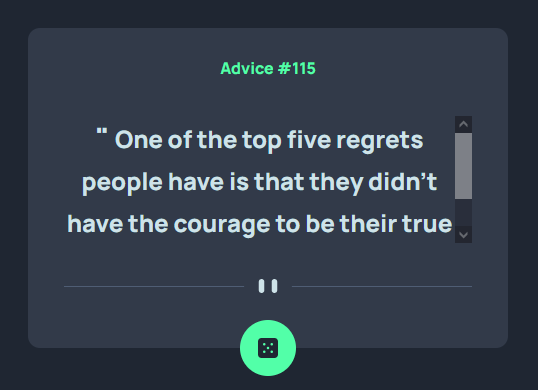
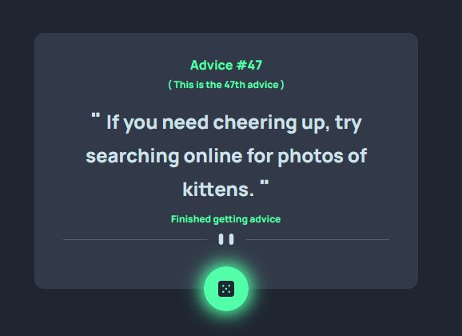

# Frontend Mentor - Advice generator app solution

This is a solution to the [Advice generator app challenge on Frontend Mentor](https://www.frontendmentor.io/challenges/advice-generator-app-QdUG-13db). Frontend Mentor challenges help you improve your coding skills by building realistic projects.

## Table of contents

- [Overview](#overview)
  - [The challenge](#the-challenge)
  - [Screenshot](#screenshot)
  - [Links](#links)
- [My process](#my-process)
  - [Built with](#built-with)
  - [What I learned](#what-i-learned)
- [Author](#author)

## Overview

### The challenge

Users should be able to:

- View the optimal layout for the app depending on their device's screen size
- See hover states for all interactive elements on the page
- Generate a new piece of advice by clicking the dice icon

### Screenshot




### Links

- Solution URL: [My solution url in Frontend mentor](https://www.frontendmentor.io/solutions/a-fully-responsive-advice-generator-app-with-tailwindcss-javascript-0eeBxM_Loz)
- Live Site URL: [My live site url in GitHub](https://adib27moghimi.github.io/FEM-06-advice-generator-app/)

## My process

### Built with

- Semantic HTML5 markup
- CSS3
- Flexbox
- Mobile-first workflow
- [tailwindcss](https://tailwindcss.com/) - A utility-first CSS framework

### What I learned

```html
<meta name="author" content="Adib Moghimi" />
<meta name="robots" content="index,follow,max-image-pre" />
<meta
  name="description"
  content="A fully responsive advice generator app made using html5, css3, tailwindcss and pure javascript, which has an attractive UI/UX and displays all interactions with the user when hovering and clicking on the button."
/>
```

```css
/** @type {import('tailwindcss').Config} */

/* Basic method of configuration */
module.exports = {
  content: ["./src/**/*.js", "./index.html"],
  theme: {
    extend: {
      colors: {
        primary: {
          cyan: {
            light: "hsl(193, 38%, 86%)",
          },
          green: {
            neon: " hsl(150, 100%, 66%)",
          },
        },
        neutral: {
          blue: {
            grayish: {
              DEFAULT: " hsl(217, 19%, 38%)",
              dark: "hsl(217, 19%, 24%)",
            },
            dark: "hsl(218, 23%, 16%)",
          },
        },
      },
      screens: {
        max375: { max: "375px" },
        mobile2: "375px",
        laptop: "1024px",
      },
      fontFamily: {
        manrope: ["Manrope", "sans-serif"],
      },
      fontSize: {
        optical: "auto",
      },
      fontWeight: {
        800: "800",
      },
    },
  },
  plugins: [],
};

```

```js
// Check scroll function
export default function CheckScroll(element) {
  element.classList.toggle(
    "overflow-y-scroll",
    element.scrollHeight > element.clientHeight
  );
}

// Function to get JASON file
export default async function GetJason(url, errorMsg = "Something went wrong") {
  const randomAdvice = await fetch(url);
  if (!randomAdvice.ok) throw new Error(`${errorMsg} (${randomAdvice.status})`);
  const { slip } = await randomAdvice.json();
  return slip;
}

// Function to convert integers in ordinal numbers
export default function OrdinalNumber(integer1UP) {
  return `${integer1UP}${
    ["th", "st", "nd", "rd"][
      (integer1UP % 100 > 10 && integer1UP % 100 < 14) || integer1UP % 10 > 3
        ? 0
        : integer1UP % 10
    ]
  }`;
}

document.addEventListener("DOMContentLoaded", () => CheckScroll(adviceContent));
```

## Author

- Frontend Mentor - [@Adib27Moghimi](https://www.frontendmentor.io/profile/Adib27Moghimi)
- GitHub - [Adib27Moghimi](https://github.com/Adib27Moghimi)
- Telegram - [@Adib70m](https://t.me/Adib70m)
